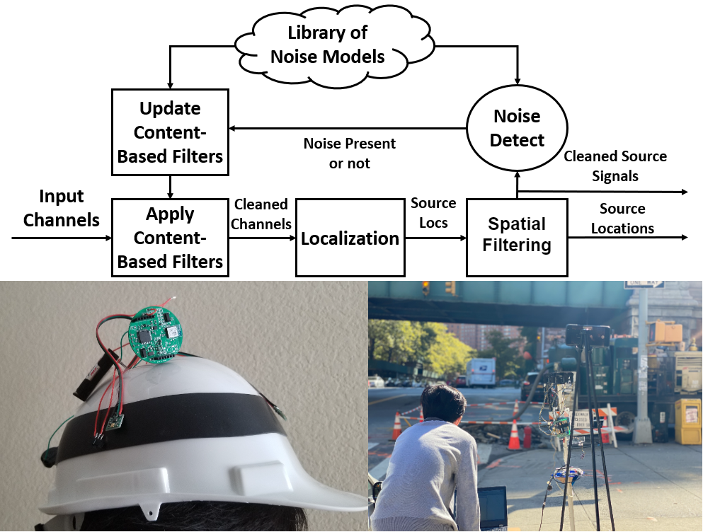

<h2>Embedded Intelligence for Acoustics</h2>

   

       
    

    

        <h2 style="color: gray">Adaptive Audio Filtering for Mobile, Embedded, and Cyber-Physical Systems</h2>
        

            

                There are many applications that would benefit from a platform that allows users and developers to select which sounds to keep and enhance and sounds/noises to remove and filter out. 
                Such a platform is difficult to realize because of the large number of different sounds, models, and signal representations that developers may use in their applications. 
                We introduce a novel acoustic selective filtering architecture that intelligently integrates the physics of sound waves with a wide range of data-driven models in an adaptive feedback 
                architecture to filter and enhance sounds depending on the application. In creating this platform, we have demonstrated the benefits of acoustic filtering in a wide range of domains, ranging 
                from audio privacy to mobile health.
            

            

                Project Page: <a href="http://icsl.ee.columbia.edu/ava-adaptive-audio-filtering-for-mobile-embedded-and-cyber-physical-systems/">Link</a> 
                Publications: [<a href="https://ieeexplore.ieee.org/abstract/document/9825986">IPSN 2022</a>], 
                [<a href="https://dl.acm.org/doi/abs/10.1145/3539490.3539598">IASA 2022</a>], 
                [<a href="https://dl.acm.org/doi/abs/10.1145/3412382.3458784">IPSN 2021 (Poster)</a>], 
                [<a href="https://dl.acm.org/doi/abs/10.1145/3417313.3429383">AIChallengeIoT 2020</a>]
            

        

    

<h2>Audio Wearables for Urban Safety</h2>

   

       
    

    

        <h2 style="color: gray">Pedestrian Safety</h2>
        

            

                We have become engrossed in our personal smartphones and other devices in today's
                society, even during instances that place our lives at risk. We design a low-power wearable
                headset mounted with an array of MEMS microphones to detect and localize oncoming
                cars to be worn by pedestrians engaged in music or talking on the phone while on
                the streets. The headset extracts and transmits audio features to the smartphone,
                which detects and localizes oncoming cars using novel machine learning and signal processing
                techniques. Our wearable platform provides pedestrians with a second set of ears
                to detect life-threatening situations in urban environments when their own ears
                are preoccupied.
            

            

                Project Page: <a href="http://icsl.ee.columbia.edu/paws/">Link</a> 
                Publications: [<a href="https://ieeexplore.ieee.org/abstract/document/8662658">IoT Journal 2019</a>],
                [<a href="https://ieeexplore.ieee.org/abstract/document/8366992">IoTDI 2018</a>], 
                [<a href="https://ieeexplore.ieee.org/document/8367017">IoTDI 2018 (Demo)</a>],
                [<a href="https://ieeexplore.ieee.org/abstract/document/8628320">VNC 2018</a>],
                [<a href="https://dl.acm.org/doi/abs/10.1145/2994551.2996547">SenSys 2016 (Demo)</a>]  
                News and Media: <a href="https://nypost.com/2019/12/27/smart-headphones-could-save-pedestrians-from-being-hit-by-cars/">New York Post</a>, 
                <a href="https://spectrum.ieee.org/ai-headphone-pedestrians-safety-warning-cars">IEEE Spectrum</a>, 
                <a href="https://www.fastcompany.com/90441385/these-headphones-arent-pretty-but-they-just-might-save-your-life">Fast Company</a>, 
                <a href="https://mashable.com/article/headphones-that-detect-cars">Mashable</a>, 
                <a href="https://gizmodo.com/these-noise-canceling-headphones-will-alert-you-to-all-1840337848">Gizmodo</a>, 
                <a href="https://www.telegraph.co.uk/technology/2019/12/26/smart-headphones-designed-save-pedestrian-lives/">The Telegraph</a>, 
                <a href="https://www.engineering.com/story/this-intelligent-headphone-system-could-potentially-minimize-pedestrian-deaths">Engineering.com</a>, 
                <a href="https://www.indiatimes.com/technology/news/researchers-design-headphones-that-will-save-its-wearer-from-getting-in-an-accident-while-walking-503346.html">India Times</a>, 
                <a href="https://signalprocessingsociety.org/publications-resources/ieee-signal-processing-magazine/signal-processing-supports-new-wave-audio">IEEE Signal Processing Magazine</a>
            

        

    

   

       
    

    

        <h2 style="color: gray">Construction Safety</h2>
        

            

                Construction worker safety is one of the most challenging scenarios in urban safety because construction sounds are often orders of magnitude louder than vehicles. 
                Building on our work on pedestrian safety, we developed and integrated a novel adaptive noise filtering architecture into a construction helmet wearable that filters out construction sounds, improving vehicle detection and localization. Our architecture leverages data-driven models of common construction tool sounds in conjunction with spatial audio filtering to robustly remove construction noises, while remaining light-weight.
            

            

                Project Page: <a href="http://icsl.ee.columbia.edu/csafe/">Link</a> 
                Publications: [<a href="https://dl.acm.org/doi/abs/10.1145/3412382.3458267">IPSN 2021</a>]
            

        

    

</h2>Platforms for Smarter and Healthier Built Environments</h2>

   

       
    

    

        <h2 style="color: gray">Drone-based Systems for Intelligent and Autonomous Homes</h2>
        

            

                Homes are becoming more intelligent due to the growth of smart sensors and devices found in typical homes. However, most of these sensors and devices function independently from one another, limiting the amount of utility and services a truly “smart” home can provide. We introduce two key ideas towards more intelligent homes. First, we explore the usage of mobile drones in the home environment. Second, we propose a system that seamlessly connects to the home environment and automatically discovers and jointly utilizes smart sensors and actuators around the home to provide services that are otherwise not possible.
            

            

                Publications: [<a href="https://dl.acm.org/doi/abs/10.1145/3412382.3458267">SenSys 2021 (Demo)</a>], 
                [<a href="https://www.youtube.com/watch?v=HxFvBUEluy0">Demo</a>]
            

        

    

   

       
    

    

        <h2 style="color: gray">Self-Orienting Camera Networks for Floor Mapping and Indoor Tracking</h2>
        

            

                Calibrating and setting up camera networks for indoor tracking and a wide range of other tasks often requires professionals to calibrate and adapt each camera to every unique building floor map. We created an easily-deployed and privacy-preserving camera network system for indoor occupant tracking that self-localizes and calibrates each camera within the network without requiring users to provide any real-world references. Our system accomplishes this by leveraging the movements of people using the space in daily life to self-localize cameras, before generating the floor map of the covered space to begin tracking occupants throughout the environment.
            

            

                Publications: [<a href="https://ieeexplore.ieee.org/abstract/document/9881634/">DCOSS 2022</a>]
            

        

    

   

       
    

    

        <h2 style="color: gray">Building Energy Footprinting</h2>
        

            

                With the rise of population and emergence of smart buildings and smart cities, conserving energy is of prime importance. While people are careful about their usage at home, energy wastage in public buildings/offices goes unaccounted for as users do not pay for it. We develop a system that can generate real-time energy footprint for all users and provide related data analytics to help conserve their energy and even implement advanced functionalities such as prediction and modeling.
            

            

                Project Page: <a href="http://icsl.ee.columbia.edu/projects/building-energy-optimization/personal-energy-footprinting/">Link</a> 
                Publications: [<a href="https://dl.acm.org/doi/abs/10.1145/3218582">TOSN 2018</a>], 
                [<a href="https://dl.acm.org/doi/abs/10.1145/3137133.3137150">BuildSys 2017</a>]
            

        

    

   

       
    

    

        <h2 style="color: gray">Energy Saving Recommender Systems</h2>
        

            

                Recent research efforts have made significant progress in reducing commercial building energy consumption through a variety of methods, including optimizing building heating, ventilation, and air conditioning (HVAC), lighting, and personal electric devices. However, these works focus on reducing energy consuming resources while treating occupants as immovable objects separate from the building energy optimization problem. In this work, we create a recommender system for reducing energy consumption in commercial buildings with human-in-the-loop, by recommending users energy-saving actions (move to room A, change setpoint temperature, etc.). We formulate the building energy optimization problem as a Markov Decision Process, show how deep reinforcement learning can be used to learn energy saving recommendations, and effectively engage occupants in energy-saving actions.
            

            

                Project Page: <a href="http://icsl.ee.columbia.edu/projects/building-energy-optimization/recenergy-an-energy-saving-recommender-system/">Link</a> 
                Publications: [<a href="https://ieeexplore.ieee.org/document/9001078">IoTJ 2020</a>], 
                [<a href="https://dl.acm.org/doi/10.1145/3209219.3209244">UMAP 2018</a>]
            

        

    

</h2>Mobile Health</h2>

   

       
    

    

        <h2 style="color: gray">Low-Cost In-Situ System for Continuous Multi-Person Fever Screening</h2>
        

            

                With the recent societal impact of COVID-19, companies and government agencies alike have turned to thermal camera based skin temperature sensing technology to help screen for fever. However, the cost and deployment restrictions limit the wide use of these thermal sensing technologies. Existing works require an employee to manually take temperature measurements or require the user to stand facing a thermal scanner. In this work, we present a low-cost system based on a RGB-thermal camera for continuous fever screening of multiple people. This system detects and tracks heads in the RGB and thermal domains and constructs thermal heat map models for each tracked person, as they move about daily life. Combining these thermal heat map models of the head with physical models of heat dissipation, we robustly detect and measure temperature without requiring users to stop or manually take a measurement.
            

            

                Project Page: <a href="http://icsl.ee.columbia.edu/sifter-low-cost-in-situ-system-for-continuous-multi-person-fever-screening/">Link</a> 
                Publications: [<a href="https://ieeexplore.ieee.org/abstract/document/9825960">IPSN 2022</a>]
            

        

    

   

       
    

    

        <h2 style="color: gray">Towards an AI-based Online Mental Status Examination</h2>
        

            

                Mental status examination (MSE) is an important tool used by mental health providers for assessing mental health. Currently, MSEs are conducted by licensed professionals, which is a barrier for patients in low-income and remote areas. We create an AI-based Personal Online Mental Status Examination, the first interactive mental status examination platform, where users can self-administer MSEs at home through a web browser, using only a camera and microphone. Our system uses multimodal image, speech and natural language processing algorithms to detect signs of abnormalities in mental functioning and recommend them for further examination by a mental health specialist.
            

            

                Publications: [<a href="https://ieeexplore.ieee.org/abstract/document/9787341">Pervasive Computing 2022</a>]
            

        

    

   

       
    

    

        <h2 style="color: gray">Smart Textiles for Continuous Perspiration Sensing</h2>
        

            

                Knowing the amount of perspiration we produce throughout the day is important for maintaining health. Existing mobile solutions for measuring perspiration often require you place a wearable device directly in contact with your skin, which may produce discomfort and can only measure the sweat at a specific location. We create a novel wearable sensor system that measures an individual’s sweat level, consisting of multiple braided cotton-covered conductive threads, that is robust to sensor distortion or the motion of the person. Because our system is made from threads, it can be easily embedded into clothing, removing the need for users to attach an additional wearable device.
            

            

                Publications: [<a href="https://www.mdpi.com/361262">Sensors 2018</a>], [<a href="https://dl.acm.org/doi/abs/10.1145/3267305.3274177">CPD 2018</a>], 
            

        

    

   

       
    

    

        <h2 style="color: gray">Wearables for Emotion Sensing</h2>
        

            

                Sensing a person's inner emotions is challenging, often requiring users to wear bulky ECG caps in laboratory settings. Outside of laboratory settings, there exist no portable and robust solutions for monitoring emotions. We create a a low-cost, long-lasting, wireless, glasses-based platform for continuous monitoring of user's facial expressions and emotions in daily life. Our system leverages a wide range of non-contact sensors (e.g., proximity sensor and thermal camera), which reduces discomfort and allows us to sense emotions even as users move about their daily lives.
            

            

                Publications: [<a href="https://ieeexplore.ieee.org/abstract/document/9097620">IoTDI 2020</a>], [<a href="https://ieeexplore.ieee.org/abstract/document/9110952">IPSN 2020 (Demo)</a>], [<a href="https://www.youtube.com/watch?v=SOX7UIqaQGQ">Demo</a>]
            

        

    

   

       
    

    

        <h2 style="color: gray">Smartphone Platforms for Intelligent Detection and Notification of Leg Shaking</h2>
        

            

                Leg shaking is something all of us can relate to; when you or someone near you sits down and unconciously begins to shake his/her leg, the generated noise and vibrations causes a disturbance. Intuition says that this problem can be resolved using the smartphone's accelerometer combined with simple processing techniques, but show that if the smartphone is not directly located on the person's shaking leg, the accelerometer can measure patterns that look like other common movements. To solve this challenge, we develop a novel PCA-based filtering algorithm that retains only the fundamental frequencies of leg shaking and incorporate this method into a smartphone-based system that leverages user feedback to improve detection performance over time by personalizing our novel filtering method to the phone owner's unique leg shaking characteristics.
            

            

                Publications: [<a href="https://www.sciencedirect.com/science/article/pii/S2352648318300540">CHASE/Smart Health 2018</a>], [<a href="https://dl.acm.org/doi/abs/10.1145/3123024.3124408">HASCA 2017</a>]
            

        

    

   

       
    

    

        <h2 style="color: gray">Intelligent Privacy Preserving Pillbox</h2>
        

            

                Ensuring patients take their medication correctly and on time is very challenging, as healthcare professionals often need to rely on patients to hold themselves accountable. Existing smart pillbox systems have been successful in notifying, tracking and reporting medication adherence, but do not provide sufficient security and privacy for the patients’ medication adherence records. We create an intelligent privacy preserving pillbox that by ensuring that medication adherence records can only be decrypted by the doctor, authorized by a face-to-face key exchange process through out-of-band communication channels. Our system gives patients fine-grained control over how their information is transmitted and shared, which has been a major privacy concern for many patients. Additionally, we develop a novel light-based sensor for detecting when a patient has taken his/her pill, which has improved performance over existing modalities (e.g., weight sensing).
            

            

                Publications: [<a href="https://www.sciencedirect.com/science/article/pii/S2352648318300473">CHASE/Smart Health 2018</a>]
            

        

    

